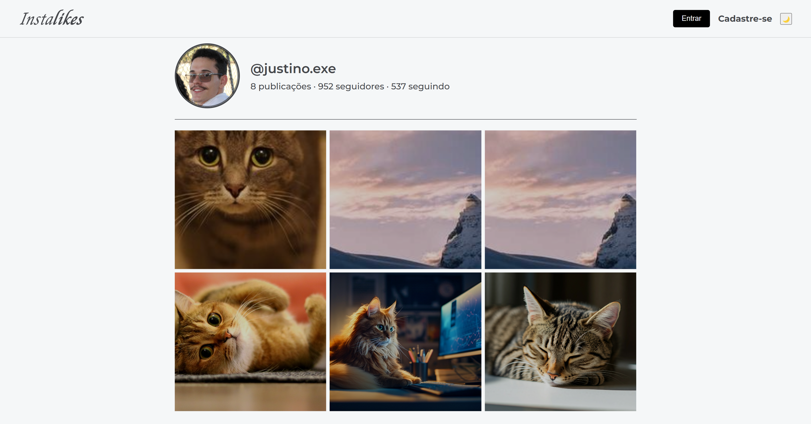
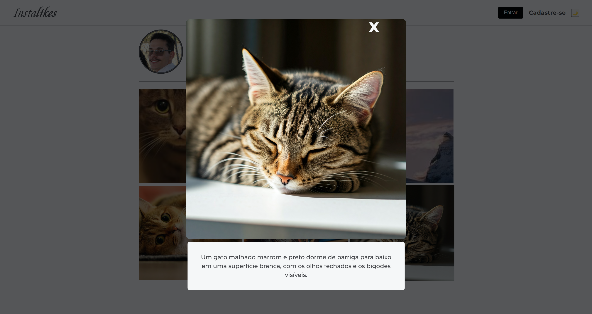

<h1 align="center">API - Instalikes </h1>
<h4 align="center"> 🚧 Em atualização... 🚧 </h4>
<div align="center">
<a href="https://choosealicense.com/licenses/mit/">
    
  </a>
  </div>

<p align="center">Serviço de API para o sistema web 'Instalikes'.</p>

## 📖 Tabela de conteúdo

<!--ts-->
* [Sobre o projeto](#Sobre-o-projeto)
* [Demonstração]( #Demonstração)
	* [Pré-requisitos](#Pré-requisitos)
	* [Rodando o servidor](#-Rodando-o-servidor)
 	* [Variáveis de Ambientes](#Variáveis-de-Ambientes)
* [Tecnologias](#-Tecnologias)
* [Funções futuras](#Funções)
* [Autor](#Autor)
* [Licença](#-Licença)
<!--te-->

## Sobre o projeto

O serviço é uma API que guarda e fornece imagens para a rede social (web) Instalikes, permitindo a solicitação das imagens pelo sistema online. Essa API foi feita junto com a [Alura](https://www.alura.com.br/) e Google na ultima imersão deste ano (2024).	<br/>
⚠ Esse projeto só aceita arquivos de imagem em ```.png``` no momento ⚠

## Demonstração
<p align="center"> API sendo usado no sistema web Instalikes </p>



---
### Pré-requisitos
 Antes de começar, você vai precisar ter instalado em sua máquina as seguintes ferramentas: [Git](https://git-scm.com), [Node.js](https://nodejs.org/en/). 
Além disto é bom ter um editor para trabalhar com o código como [VSCode](https://code.visualstudio.com/) e uma plataforma de API como o [Postman](https://www.postman.com/)

### 	🎲 Rodando o servidor
 ```bash 
 # Clone este repositório 
 $ git clone https://github.com/justino1806/imersaoBack-End 
 # Acesse o projeto pelo vsCode ou via terminal/cmd (caso faça pelo vsCode, ignore esse passo)
 $ cd imersaoBack-End
 $ code * 
 # Instale as dependências
 $ npm install 
 # Execute a aplicação em modo de desenvolvimento 
 $ npm run dev 
 # O servidor inciará na porta:3000 por padrão
 #Pode acessar por <http://localhost:3000>
 ```

### Variáveis de Ambientes
```bash
 # É importante notar que o projeto vai precisar de duas variaveis de ambiente:
 $ STRING_CONEXAO = "<valor que vai direcionar ao banco de dados do mongoDB>"
 $ GEMINI_API_KEY = "<chave da API do gemini>"
```

 <h4> Obs: para realizar upload, atualização e visualização dos dados do servidor, será necessária uma plataforma para API, minha sugestão é o Postman. </h4>

### 🛠 Tecnologias

As seguintes ferramentas foram usadas na construção do projeto:

- [Node.js](https://nodejs.org/en/)
	- [Express](https://expressjs.com/)
 	- [multer](https://github.com/expressjs/multer)
- [MongoDB](https://www.mongodb.com/)
- [Gemini AI - API](https://aistudio.google.com/apikey)


### Funções
<p> Além das funções que já estão no projeto, pretendo adicionar as seguintes futuramente:</p>

- [ ] Texto alternativo automático pelo Gemini AI
- [ ] Suporte à mais tipos de formatos de imagens (jpeg, jpg, svg, etc)
- [ ] Suporte para salvamento de foto de perfil

### Autor
---

<a href="#">
 
 <br />
 <sub><b>Justino dos Reis</b></sub></a>
 <p>	</p>

[](https://www.linkedin.com/in/justinodosreis/) 
[](https://www.instagram.com/_justino.exe_/)

---

## 📝 Licença

Este projeto está sobe a licença [MIT](./LICENSE).

---
